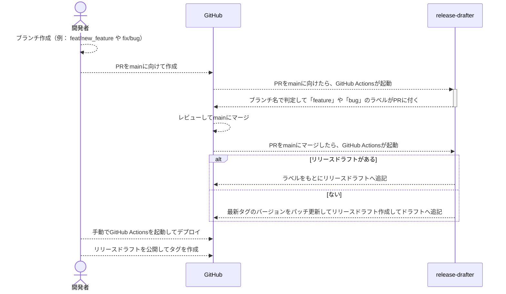

## release-drafterとは

- https://github.com/release-drafter/release-drafter のREADME.mdを参照
- OSSのように、どのバージョンでどのPRがどのような修正で行われたのか履歴を追いやすくわかりやすい

## リリースドラフトの作成フロー

## 参考

- https://github.com/masashi-sutou/release-based-workflow/releases